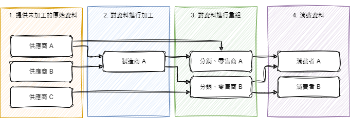

# MVU

## 觀察者模式

觀察者模式（Observer Pattern）是一種行為設計模式，用於定義物件間的一對多依賴關係，當一個物件狀態發生變化時，所有依賴於它的物件都會自動收到通知並更新。這個模式常用於實現事件處理系統。觀察者模式主要包含以下三大模組。

1. **主體（Subject）**：被觀察的物件，當其狀態改變時，會通知所有觀察者。
2. **觀察者（Observer）**：定義了一個更新接口，當主體狀態發生改變時，通過這個接口更新自己。
3. **訂閱和通知機制**：觀察者可以訂閱主體，以便在主體狀態變化時收到通知。

## MVU 架構

MVU（Model-View-Update）架構是常見的設計模式中最容易理解、實作與維護的設計架構之一，與 MVC、MVVM 架構不同 MVU 架構強調狀態管理的簡單與可靠性，因此使用 MVU 架構可以讓你的程式邏輯非常清晰且容易維護。

## 如何使用本框架

> 如果你還不了解觀察者模式以及 MVU 架構，建議你先查閱相關資料，本文將在假設你已經充分理解以上觀念前提下，介紹本框架的異動以及如何使用。

### 供應鏈 (`Provider` / `Consumer`)

> 以下範例擷取自本單元中 `Supply Chain Sample` 場景中的腳本，該腳本包含完整的實作註釋。建議開啟場景及腳本參考，以便更清楚地了解實作細節。如果想要更具體的實作案例可以參考 `04_UnitTree` 的範例場景。它演示了如何結合供應鏈、MVU 和單元樹在單元切換時優雅的改變 UI 面板。

供應鏈中包含 `Provider` 和 `Consumer` 兩大單元，請注意雖然叫做 `Provider` 但本模組是基於觀察者模式實作。在本框架中 `Provider` 相當於 `Subject`，`Consumer` 相當於 `Observer`。

與傳統的觀察者模式不同，我們的 `Provider` 也可以視為一個 `Consumer` 消費其他的 `Provider`。由於實際使用上資料傳遞很像供應鏈。因此我稱這個魔改過的觀察者模式為供應鏈模式。



如上圖所示，資料只會單向的從上游（供應商）逐步傳遞至下游（消費者），而每當任何一個單元產生變化時，都會通知其下游嘗試進行變更，直到該單元不因其上游變更而產生變化或抵達終端消費者。在本框架中 `Provider` 根據不同的實作方式可以作為供應商、製造商、分銷商或零售商，而 `Consumer` 則只能作為沒有生產能力的消費者。

#### `Provider`

要建立 `Provider` 非常簡單你只需要先定義一個紀錄類別用來傳遞資料。以及一個 `ProviderBehaviour` 用來向消費者提供資料。 

```cs
public record MyData(int Value) : State
{
    public MyData() : this(0)
    {
    }
}

public class MyDataProvider : ProviderBehaviour<MyData>
{
    protected override void Build(IProvider provider)
    {
        // 這裡是用來處理上游變更時要如何產生變化的。
        // 如果這個類別是供應商的話，這裡不需要寫任何程式碼。
        // 如果這個類別是製造、分銷或零售商，請參考 Consumer 範例進行實作。
    }

    // 簡單定義一個 +1 方法
    // 當這個方法被調用後由於 State 被重新賦值且發生變化，因此框架內部會自動通知所有訂閱它的消費者嘗試進行變更。
    public void AddOne()
    {
        State = State with
        {
            Value = State.Value + 1
        };
    }
}
```

建立 `State` 時 Unity 可能會報出錯誤以下錯誤：

> CS0518: Predefined type 'System.Runtime.CompilerServices.IsExternalInit' is not defined or imported

這是因為 Unity 的 .NET SDK 版本太舊導致的，在你的專案中新增以下腳本讓編譯器可以找到 `IsExternalInit` 變能解決這個問題。

```cs
namespace System.Runtime.CompilerServices
{
    // Hide record error message for unity
    [EditorBrowsable(EditorBrowsableState.Never)]
    internal class IsExternalInit { }
}
```

#### `Consumer`

要建立 `Consumer` 你需要先調用 `Subscribe()` 方法訂閱目標 `Provider` ，並實作 `Build()` 方法來建立提供者狀態變換時要產生的行為。

```cs
public class MyDataConsumer : ConsumerBehaviour
{
    public ProviderBehaviour[] subscribers;

    // 訂閱提供者，我們要訂閱 MyDataProvider，所以在 Inspector 中
    // 把 MyDataProvider 物件拖曳至 subscribers 欄位中。
    public void Subscribe()
    {
        Subscribe(subscribers);
        foreach (var provider in subscribers)
        {
            Debug.Log($"{provider.name} subscribed");
        }
    }
    
    // 在這裡消費註冊的提供者在狀態變換後提供的資料
    protected override void Build(IProvider provider)
    {
        // 檢查傳入的 provider 哪個類型的提供者
        if (provider is MyDataProvider myDataProvider)
        {
            // 根據提供的資料進行消費，這裡簡單的 Log 出來。
            var value = myDataProvider.State.Value;
            Debug.Log($"Your value: {value}");
        }
    }
}

```

### `MVUController`

由於遊戲 UI 相較於傳統的平面應用復用性較低，因此我們設計了一個極度簡化的非標準 MVU 架構 ，並使用 `ProviderBehaviour` 實作以集成供應鏈模組的功能，旨在讓開發者僅需一個腳本便能使用 MVU 完成一個 UI 的完整邏輯設計，並在資料提供者產生異動時自動更新。

> 以下範例擷取自本單元中 `Counter Sample` 場景的 `CounterPanelController.cs` 腳本，該腳本包含完整的實作註釋。建議開啟場景及腳本參考，以便更清楚地了解實作細節。

#### `State (Model)`

- 負責儲存物件的狀態。
- 是一個不可變（immutable）的資料結構。

State 需要繼承自 `State` 這一記錄類別 (`record class`)，並實作公有無參數建構子。

```cs
public record CounterPanelState(
    int Counter
    ) : MVUState
{
    public CounterPanelState() : this(
        Counter: 0)
    {
    }
}
```

#### `View`

- 根據 `State` 的當前狀態，生成使用者界面。
- 是一個方法，該方法要求根據輸入的 `Provider` 所提供的 State 調整 UI。

實作 `View` 需要覆寫 `MVUController` 的 `Build()` 方法，並根據傳入的 `Provider` 的狀態來更新 UI 並重新渲染。

```cs
public override void Build(IProvider provider)
{
    if (provider is CounterPanelController counterPanelController)
    {
        var state = counterPanelController.State;
        numberLabel.text = state.Counter.ToString();
    }
}
```

#### `Update`

- 處理來自使用者或系統的事件，並返回一個新的 `State`。
- 根據不同的目的會有多個 `Update` 方法，每個方法都必須重新指派 `State` 而非修改 `State` 下的屬性以保證其不可變性。

對於 Update，只需要記住統一在 `MVUController` 中更新狀態，並且永遠使用 `State = ...` 或是異步版的 `SetStateAsync()` 來賦值。這樣可以保證狀態管理符合單一職責原則，並實現關注點分離，讓程式碼更易於維護和理解。

```cs
private void AddOne()
{
    State = State with
    {
        Counter = State.Counter + 1
    };
}
```
