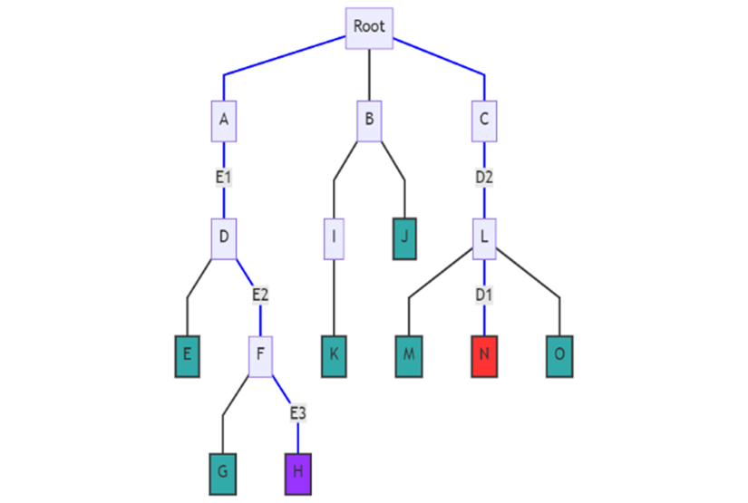
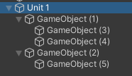
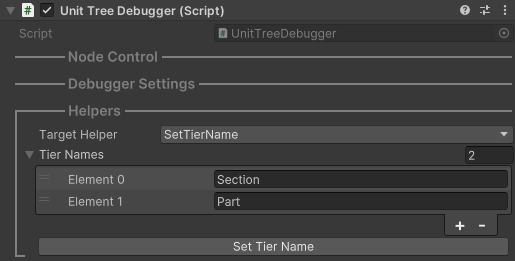
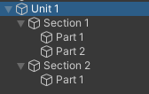
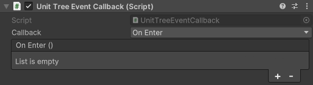
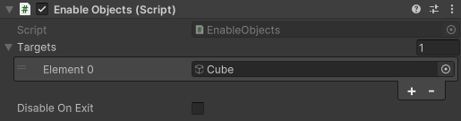

# UnitTree 單元樹

## 概觀

單元樹用於建構具有層級結構的教學場景，透過樹狀的節點組織來管理教學內容的呈現順序與節點狀態。每個節點都具有生命週期方法來處理進入與離開的狀態變化，讓開發者能夠專注於定義教學內容，而不需要過度關注狀態管理的細節。

### 單元樹概念

- 每個節點都具有進入（Enter）和離開（Exit）兩種狀態，系統會自動追蹤並管理這些狀態的變化。

- 當前節點僅能是葉節點

- 系統會確保在任何時刻僅當前葉節點及其所有祖先節點會被「進入」，其他所有節點維持在「離開」狀態。

- 一般來說你會使用一般節點管理其子孫節點共用的場景元素，葉節點負責完成具體的細節

#### 節點轉換

當節點轉換時，單元樹會：

1. 計算當前節點與目標節點的最近共同祖先 (LCA)
2. 依序「離開」當前節點至 LCA 的路徑
3. 依序「進入」從 LCA 到目標節點的路徑

以下圖為例：節點 N 轉換到節點 H。會依序「離開」N、L、C 節點；然後「進入」A、D、F、H 節點。



### 快速開始

1. 在場景中建立單元樹的根節點，並掛載 `UnitTreeController` 和 `UnitTreeDebugger` 組件

2. 在根節點下建立教學單元的階層結構



3. 你可以使用 `UnitTreeDebugger` 幫助你批次重新命名節點





4. 最後透過繼承 `UnitTreeBehaviour` 來定義節點行為並掛載到目標節點即可

```csharp
using Naukri.Moltk.UnitTree;
using Naukri.Moltk.UnitTree.Events;
using UnityEngine;

public class MyUnitTreeBehaviour : UnitTreeBehaviour
{
    protected override void OnEnter()
    {
        // 節點進入時的行為
        Debug.Log($"進入節點 {gameObject.name}");
    }

    protected override void OnExit()
    {
        // 節點離開時的行為
        Debug.Log($"離開節點 {gameObject.name}");
    }

    protected override void HandleTreeEvent(UnitTreeEvent evt)
    {
        // 處理 UnitTree 事件
        if (evt is NodeChangedEvent)
        {
            Debug.Log($"節點 {gameObject.name} 收到事件 {evt}");
        }
    }
}
```

5. 你也可以使用內置組件如 `UnitTreeEventCallback` 或是 `EnableObjects` 快速開發而不編寫腳本





### 導航功能

UnitTreeController 提供了完整的導航功能，讓開發者能夠輕鬆控制教學流程：

- `MoveNext()`: 移動至下一個葉節點
- `RollBack()`: 返回至上一個葉節點
- `MoveTo(Transform target)`: 直接跳轉至指定節點
- `GetNext()`: 取得下一個葉節點
- `GetPrevious()`: 取得上一個葉節點

### 輔助開發工具

開發者可以掛載 `UnitTreeDebugger` 組件來啟用以下功能：

- 在執行時期監控當前節點狀態
- 快速切換至任意節點
- 批次重新命名節點
- 自動在 Hierarchy 視窗中標示當前節點位置

## API 參考

### UnitTreeController

單元樹的核心控制組件，負責管理節點狀態與導航。

#### 屬性

- `CurrentNode`: 取得當前的活動節點
- `EventHandler`: 取得事件處理器

#### 方法

- `MoveTo(Transform target)`: 移動至指定節點
- `MoveNext()`: 移動至下一個葉節點
- `RollBack()`: 返回至上一個葉節點
- `GetNext()`: 取得下一個葉節點
- `GetPrevious()`: 取得上一個葉節點

### UnitTreeBehaviour

定義節點行為的基礎類別。

#### 屬性

- `Controller`: 取得該節點所屬的 UnitTreeController

#### 方法

- `OnEnter()`: 節點進入時觸發
- `OnExit()`: 節點離開時觸發
- `HandleTreeEvent(UnitTreeEvent evt)`: 處理樹狀事件
- `SendEvent<T>(EventType eventType)`: 發送自定義事件
- `GetRelativePath()`: 取得相對於控制器的路徑

### UnitTreeEventCallback

快速註冊節點事件的輔助組件。

#### 屬性

- `callback`: 設定要響應的事件類型 (OnEnter/OnExit)
- `onEnter`: 進入節點時的回調事件
- `onExit`: 離開節點時的回調事件
