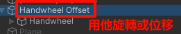
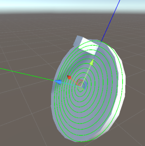

# XR Interaction

`XRInteraction` 提供了 VR 工業操作教學專案中常用到物件行為的實作，開發者可以透過掛載以下腳本來快速完成對應功能的開發。也可以透過繼承並覆寫的方式客製化。

為了保持文檔簡潔，不會將所有細節的參數和方法都逐一介紹，如果有客製化功能的需求可以先檢查有沒有相關的設定參數，若沒有再自行實作。

## Switch 開關

> 雖然叫做開關，但其實檔位可以設定不只兩檔

1. 將物件掛上 `MoltkSwitch` 腳本並根據提示完前置設定。
2. 使用 `CurrentState` 和 `States` 指定起始狀態和全部狀態
3. 使用 `SwitchType` 選擇切換時機，你也可以不指定並透過調用`SetState()` 或 `NextState()` 來切換狀態。
4. 透過 `Events` 群組中的 `OnStateChanged` 監聽事件變化並產生對應效果即可。
## Handwheel 手輪

1. 將手輪物件的 Postion 和 Rotation 歸 0 ，如果需要旋轉的話，可以在 Handwheel 物件上新增一個父物件透過父物件進行改變。
	
2. 在手輪物件上掛 `MoltkHandwheel` 腳本，他會指引你完成剩餘的前置步驟
3. 完成前置步驟後你會新增一個名為 `[Handwheel] Plane` 的物件並有一個 `MoltkPlane` 腳本在上面，點擊 Show Plane 讓 Editor 顯示當前的平面。
	
4. 旋轉平面，讓平面貼合手輪，並讓藍線對齊手把。
	
5. 回到 `MoltkHandwheel`，指定 `RotateAxis` 改變旋轉軸向，不同的物件要旋轉的軸向會有所不同，在本例中需要將 `RotateAxis` 改為 `Up`。你可以使用 `Debug` 群組裡面的 `SetAngle()` 來輔助設定。但設定完成後需要將角度歸 0。
6. 完成設定後即可上機測試效果。

## Knob 旋鈕

1. 旋鈕可以理解為手輪版的開關 。前置設定的具體步驟請參考[Handwheel](#Handwheel)不進行贅述。
2. 和 `Switch` 不一樣，`Knob` 的狀態是由旋鈕旋轉的角度來決定的。因此你需要在 `KnobState` 中設定 `AngleRange` 來指定觸發範圍，若當前角度同時滿足兩個以上的範圍，會以前面的狀態優先。
3. 旋鈕不會和手輪一樣可以無限旋轉，你可以在 `Optional` 群組中開啟 Limit Angle 設定可旋轉的角度範圍。
4. 你也可以透過調用 `SetState()` 來強制改變 `Knob` 當前的狀態，這時候物件的角度會旋轉到對應 `KnobState` 的 `preferredAngle` 。

## Debug Interactor

`DebugInteractor` 可以讓你在不使用 XR 裝置的情況下進行簡單的偵錯，這在早期測試中相當方便。

1. 建立一個物件並掛上 `DebugInteractor`。
2. 把藥互動的 `XRInteractable` 物件放到 `Interactable` 欄位中。
3.  點擊 Play 在編輯器中開始遊戲，這時候你會發現原本被禁用的事件可以被觸發了。
4. 選擇事件便可以與 `XRInteractable` 做出簡單的互動了。