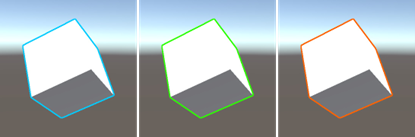

# Outline

Outline 模組是基於 [UnityFx.Outline](https://github.com/Arvtesh/UnityFx.Outline) 的輪廓工具，用於讓物件產生高光等效果。

## 快速開始

1. 安裝 `UnityFx.Outline` 到目標的專案中。
2. 在場景中新增一個物件並掛上 `OutlineService` 腳本。
3. 根據 Inspector 上的提示完成基本設定。設定完成後應該會出現一個名為 `MoltkManager` 的物件，這是用來管理 Moltk 服務的單例腳本。你可以使用 `MoltkManager.GetService()` 來取得特定服務。
4. 完成！現在你可以透過 OutlineService 實例調用 API 來將物體高光了。
```cs
GameObject targetGameObject;

public void Highlight()
{
	// 取得服務
	outlineService = MoltkManager.GetService<OutlineService>();
	// 高光物件
	outlineService.Highlight(targetGameObject, true); // 指定開關
    outlineService.ToggleHighlight(targetGameObject); // 切換
    var isHighlight = outlineService.IsHighlighted(targetGameObject); // 檢查狀態
	// 還有 Hover 和 Select 兩個版本，為了保持文黨簡潔就不逐個列舉。
}
```

除了外輪廓之外，你還可以透過為物件掛載 `TooltipTrigger` 在外輪廓產生時額外顯示工具提示況。

1. 掛載 `TooltipTrigger` 組件到目標物件，並根據提示完成設置以生成 `Tooltip` 物件等相依物件
2. 你可以透過調整 `TooltipTrigger.Trigger` 改變觸發時機、`TooltipTrigger.TooltipText` 改變提示框文字
3. 你可以透過以下方法來改變提示線風格
	- 移動 `[Tooltip Anchor]` 物件改變提示框起點
	- 調整 `Tooltip.InflectionPointRatio` 參數改變拐點
	- 移動 `Tooltip.Text` 物件改變終點
	- 調整 `Tooltip.TooltipLine.LineRenderer` 組件改變線段風格

4. 你可以透過調整 `Tooltip.Text` 組件改變文字風格

> 更完整的使用範例請參考 `Outline Sample` 場景。