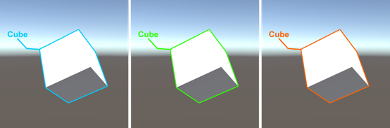
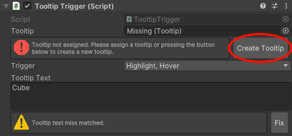
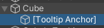

# Outline 外輪廓

## 概觀


Outline 模組提供了一個簡單且完整的外框效果解決方案，透過 `OutlineService` 可以輕鬆為目標物件添加外框效果，並能夠根據不同的互動狀態（高亮、懸停、選取）顯示不同顏色的外框。

### 快速開始

1. 在場景中掛載 `OutlineService` 啟用服務
2. 透過該服務對指定 `GameObject` 產生外輪廓

```csharp
using Naukri.Moltk.Outline;
using Naukri.Physarum;
using UnityEngine;

public class OutlineExample : Consumer.Behaviour
{
    public GameObject targetObject;

    private OutlineService outlineService;

    public void SetOutline()
    {
        // 開啟高亮狀態
        outlineService.Highlight(targetObject);

        // 切換高亮狀態
        outlineService.ToggleHighlight(targetObject);

        // 檢查高亮狀態
        var isHighlighted = outlineService.IsHighlighted(targetObject);
    }

    protected override void Build()
    {
        outlineService = ctx.Read<OutlineService>();
    }
}
```

### Tooltip

你可以為物件掛載 `TooltipTrigger` 組件，使其在特定狀態下顯示工具提示。工具提示會以線條連接目標物件與提示文字，並根據物件當前的狀態自動改變顏色，使其與外輪廓效果相呼應。文字區塊會自動面向使用者視角，確保提示內容始終清晰可見。



1. 掛載 `TooltipTrigger` 組件到目標物件上，並點擊「Create Tooltip」按鈕來建立與設定提示框物件。



2. 透過 `TooltipTrigger.Trigger` 選擇提示框的觸發時機，該時機相依於 `OutlineService` 提供的狀態。
3. 使用 `TooltipTrigger.TooltipText` 設定要顯示的提示文字。

#### 調整提示框的外觀

- 移動 `[Tooltip Anchor]` 物件可以改變提示線的起始點



- 調整 `Tooltip.InflectionPointRatio` 參數可以控制提示線的拐點位置
- 移動 `Tooltip.Text` 物件可以調整提示文字的顯示位置
- 透過 `Tooltip.TooltipLine` 組件設定提示線的樣式

## API 參考

### OutlineService

主要的外框服務類別，負責管理場景中所有物件的外框效果。

若須使用此模組，你需要保證 `OutlineService` 存在於場景之中。

#### 屬性

- `HighlightColor`: 取得或設定高亮外框顏色
- `HoverColor`: 取得或設定懸停外框顏色
- `SelectColor`: 取得或設定選取外框顏色

#### 方法

- `Highlight(GameObject go, bool highlight = true)`: 設定物件的高亮狀態
- `Select(GameObject go, bool select = true)`: 設定物件的選取狀態
- `Hover(GameObject go, bool hover = true)`: 設定物件的懸停狀態
- `ToggleHighlight(GameObject go)`: 切換物件的高亮狀態
- `ToggleSelect(GameObject go)`: 切換物件的選取狀態
- `ToggleHover(GameObject go)`: 切換物件的懸停狀態
- `IsHighlighted(GameObject go)`: 檢查物件是否處於高亮狀態
- `IsSelected(GameObject go)`: 檢查物件是否處於選取狀態
- `IsHovered(GameObject go)`: 檢查物件是否處於懸停狀態

### TooltipTrigger

提供工具提示功能的組件，可以在物件產生外框效果時顯示對應的提示文字。

#### 屬性

- `tooltip`: Tooltip 組件參考
- `trigger`: 設定觸發提示的條件（Highlight、Hover、Select）
- `TooltipText`: 設定或取得提示文字內容

#### 方法

- `CreateTooltip()`: 創建並設定 Tooltip 組件
- `ShowTooltip()`: 顯示工具提示
- `HideTooltip()`: 隱藏工具提示

### Tooltip

控制工具提示外觀和位置的組件。

#### 屬性

- `Anchor`: 提示線的起始位置
- `Face`: 提示框面向的目標
- `Text`: 提示文字組件
- `TooltipLine`: 提示線組件
- `InflectionPointRatio`: 設定提示線的拐點比例

#### 方法

- `SetColor(Color color)`: 設定提示文字和提示線的顏色