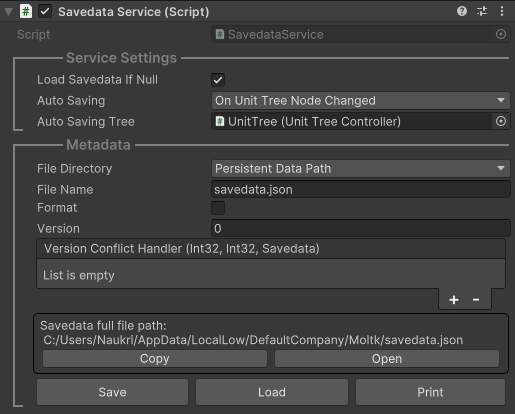
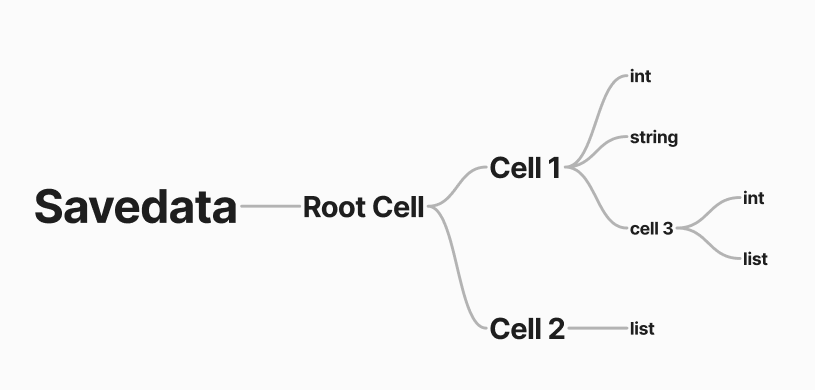

# DataStorage

DataStorage 是一個極簡的記憶體鍵值儲資料庫，並且支援無限巢狀結構，讓一切資料只需一種方式就能快速存取。並使用 [Newtonsoft Json Unity Package](https://docs.unity3d.com/Packages/com.unity.nuget.newtonsoft-json@3.0/manual/index.html) 進行序列、反序列化，使資料以 JSON 的格式永久保存。

## 概觀

```cs
public void Overview()
{
    // * Load savedata
    var savedataService = MoltkManager.GetService<SavedataService>();
    savedataService.Load();
    var savedata = savedataService.Savedata;
    // * Create cell
    var cell = savedata["Cell 1"];
    cell.CreateIfNotExist();
    // * Set cell
    cell.SetValue("myInt", 2048);
    // * Get cell
    var myInt = cell.GetValue<int>("myInt");
    // * Delete cell
    cell.DeleteValue("myInt");
    // Save savedata
    savedataService.Save();
}
```

## 模組簡介

### `Savedata`

`Savedata` 是本功能的主要驅動器，用來管理 Cell Tree 以及載入、儲存 JSON 檔案。但絕大部分時候你只會使用他的存取器來取得 `CellProperty`，我們將在後面介紹什麼是 `CellProperty`。

```cs
var savedata = Savedata.LoadFromJson(@"{'hello': 'world'}");
var cell = savedata["hello"];
```

### `SavedataService`

`SavedataService` 是 `Savedata` 的包裝器，可以讓你在 Inspector 上更方便快捷的操作 `Savedata`。如果沒有特別的需求你應該使用他而非 `Savedata` 來建立存檔。


雖然 `SavedataService` 提供了一個自動化的載入/儲存系統，但你仍可以透過調用指定方法在特定事件中進行載入/存檔。

```cs
savedataService.Load();
savedataService.Save();
```

最後在 `SavedataService` 中還有一個屬性 `Savedata` 是用來存取 `Savedata` 的實例。

```cs
var savedata = savedataService.Savedata;
```
### `Cell`
 
Cell 是本系統中最重要的概念，任何資料都會儲存在 Cell 之中，Cell 也可以儲存另一個 Cell 達成嵌套如下圖所示：

不過為了保護資料安全，你並不會直接使用到 `Cell` 而是使用 `CellProperty` 來間接存取資料。
### `CellProperty`

`CellProeprty` 是 `Cell` 的存取工具，用來避免使用者直接操作 `Cell` 而產生非預期的行為。請參考以下範例來使用 `CellProperty`：

#### Create

```cs
var cell = savedata["Cell 1"];
cell.CreateIfNotExist();
```

#### Set

```cs
// By JSON
cell.SetCell(@"{ 'string': 'hello', 'int': 1024, float: 3.14, 'bool': true, 'list': [1, 2, 3], 'dict': { 'key': 'value' } }");

// By key-value
cell.SetValue("int2", 2048);                     // value
cell.SetValue("list2", new[] { 4, 5, 6 });       // list
cell.SetValue("dict2", new { key2 = "value2" }); // dict
```

#### Get

```cs
var str = cell.GetValue<string>("string");       // value
var list = cell.GetValue<List<object>>("list");  // list
var listValue = Convert.ToInt32(list[0]);        // list's value
var dict = cell.GetValue<IDictionary<string, object>>("dict");  // dict
var dictValue = Convert.ToString(dict["key"]);    // dict's value
var dictValueByCell = cell["dict"].GetValue<string>("key"); // dict's value by Cell (recommend)
```

#### Delete

```cs
cell.DeleteValue("int2");           // delete value by key
cell.ClearCell();                   // delete all values
cell.Parent.DeleteValue("Cell 1");  // delete cell
```


## SavedataNode

我們還提供了一個名為 `SavedataNode` 的單元樹節點用於幫助開發者快速的在 UnitTree 上建立及查看存檔節點。請參考 `SavedataNode Sample` 場景以及 `HelloSavedataNode` 以了解如何透過繼承 `SavedataNode` 建立客製化的儲存節點。

