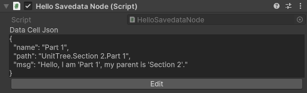

# DataStorage 存檔

## 概觀

DataStorage 模組提供了一個彈性且易用的存檔解決方案。基於鍵值結構設計，支援無限巢狀的資料組織，並使用JSON格式進行存取。透過 `SavedataService` 可以輕鬆管理存檔的讀寫，並提供自動存檔等進階功能。


### 快速開始

1. 在場景中掛載 `SavedataService` 啟用服務


2. 透過該服務存取及管理資料

```csharp
using Naukri.Moltk.DataStorage;
using Naukri.Physarum;
using UnityEngine;

public class DataStorageExample : Consumer.Behaviour
{
    private SavedataService savedataService;

    public void SaveAndLoadData()
    {
        // 建立儲存單位
        var cell = savedataService.Savedata["userData"];
        cell.CreateIfNotExist();

        // 儲存資料
        cell.SetValue("score", 100);
        cell.SetValue("name", "Player");
        cell.SetCell(@"{'items': [1, 2, 3]}");

        // 讀取資料
        var score = cell.GetValue<int>("score");
        var name = cell.GetValue<string>("name");

        // 刪除資料
        cell.DeleteValue("score");
        cell.ClearCell();
    }

    protected override void Build()
    {
        savedataService = ctx.Read<SavedataService>();
    }
}
```

### 與單元樹整合

透過 `SavedataNode` 組件可以快速建立與單元樹節點對應的存檔資料。

3. 繼承 `SavedataNode` 並透過 `DataCell` 存取資料

```csharp
public class HelloSavedataNode : SavedataNode
{
    protected override void OnEnter()
    {
        base.OnEnter();
        DataCell.SetValue("name", gameObject.name);
        DataCell.SetValue("path", DataCell.Path);
    }
}
```

1. 掛載實作之組件到目標節點上


2. 透過 Inspector 可以在運行時預覽或編輯該節點的存檔內容



## API 參考

### SavedataService

主要的存檔服務類別，負責管理存檔的讀寫操作。

#### 屬性

- `Savedata`: 取得當前的存檔實例
- `FilePath`: 取得存檔檔案的完整路徑

#### 方法

- `Load()`: 從檔案載入存檔
- `Save()`: 將當前存檔寫入檔案

### CellProperty

存檔系統的核心類別，提供資料存取介面。

#### 屬性

- `Path`: 取得該儲存單位的完整路徑
- `Parent`: 取得父層儲存單位

#### 方法

- `CreateIfNotExist()`: 確保儲存單位存在
- `SetValue<T>(string key, T value)`: 設定指定鍵的值
- `GetValue<T>(string key)`: 取得指定鍵的值
- `SetCell(string json, bool append = false)`: 透過JSON設定儲存單位內容
- `DeleteValue(string key)`: 刪除指定鍵的值
- `ClearCell()`: 清空儲存單位
- `ToJson(bool format = false)`: 將儲存單位序列化為JSON

### SavedataNode

提供與單元樹整合的存檔節點組件。

#### 屬性

- `DataCell`: 取得對應該節點的儲存單位